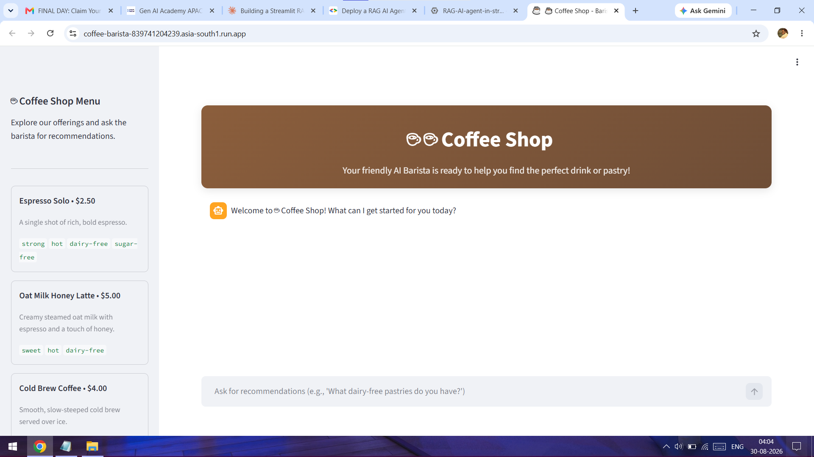
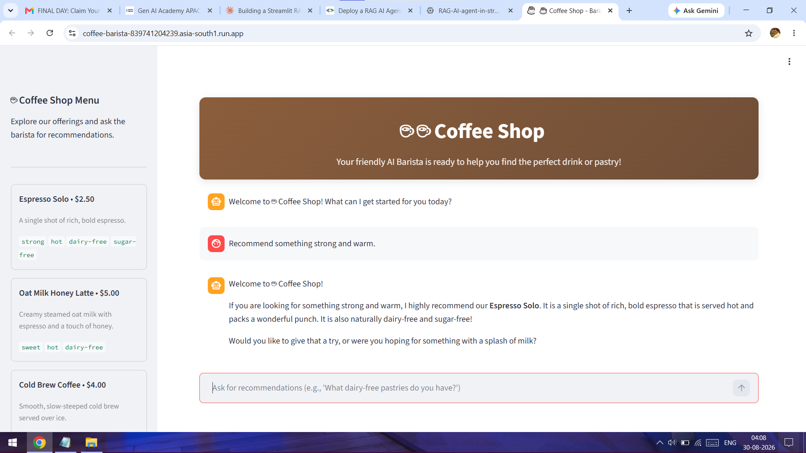
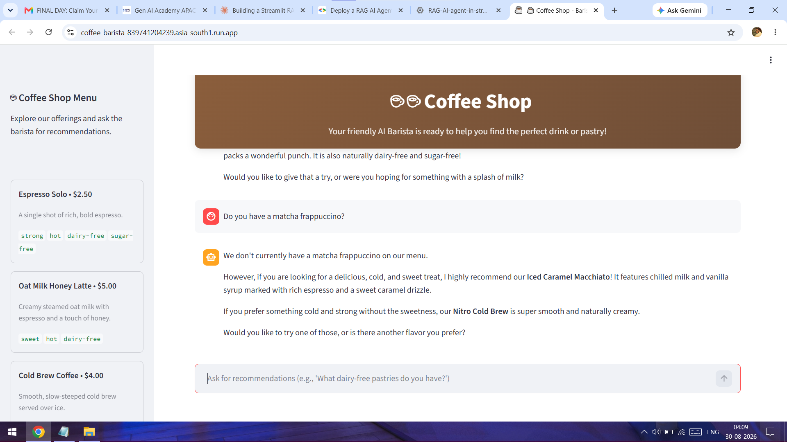
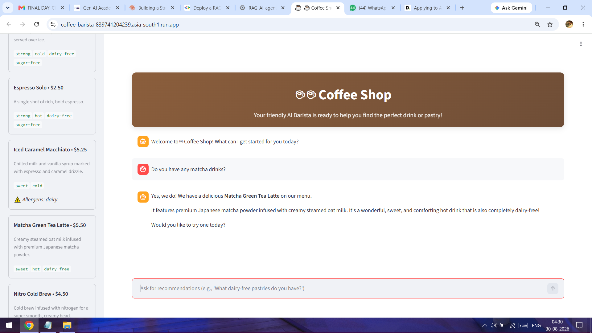
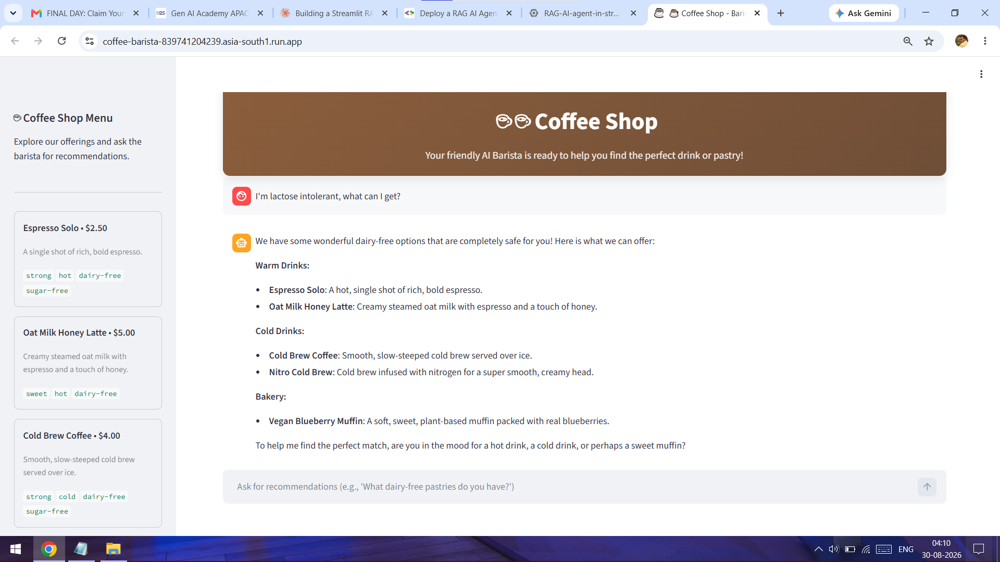

# ☕ Coffee Barista Agent

An AI-powered coffee shop assistant that helps customers discover drinks, get personalized recommendations, and make menu choices through natural conversation.

The agent uses **Google ADK, Gemini, Firestore Vector Search, Gemini embeddings, and Streamlit** to build a grounded RAG-based coffee assistant.



## 🚀 Overview

The Coffee Barista Agent acts as a virtual coffee shop assistant.

Customers can describe what they want in natural language, such as:

- "I want something strong."
- "Recommend me a matcha drink."
- "What can I have if I'm lactose intolerant?"
- "Tell me about this drink."
- "Add the matcha frappuccino."

The agent searches the coffee shop's menu data and uses the retrieved information to generate relevant responses.

A key part of the design is that the agent is instructed to recommend **only menu items returned by the menu retrieval tool**, helping keep recommendations grounded in the available menu rather than allowing the model to invent products.

---

## 🧠 How It Works

The application follows a Retrieval-Augmented Generation (RAG) workflow:

```text
                    ┌──────────────────┐
                    │     User         │
                    └────────┬─────────┘
                             │
                             ▼
                    ┌──────────────────┐
                    │    Streamlit     │
                    │       UI         │
                    └────────┬─────────┘
                             │
                             ▼
                    ┌──────────────────┐
                    │   Google ADK     │
                    │      Agent       │
                    └────────┬─────────┘
                             │
                             ▼
                    ┌──────────────────┐
                    │   get_menu()     │
                    │ Retrieval Tool   │
                    └────────┬─────────┘
                             │
                             ▼
              ┌─────────────────────────────┐
              │ Firestore Vector Search     │
              │ + Gemini Embeddings         │
              └──────────────┬──────────────┘
                             │
                             ▼
                    ┌──────────────────┐
                    │ Relevant Menu    │
                    │ Information      │
                    └────────┬─────────┘
                             │
                             ▼
                    ┌──────────────────┐
                    │ Gemini generates │
                    │ final response   │
                    └──────────────────┘
```

### Data Flow

The menu data starts in `menu.json`.

`seed.py` processes the menu data and stores the required information in **Google Cloud Firestore** along with vector embeddings generated using **Gemini**.

When a customer asks a question:

1. The Google ADK agent receives the request.
2. The `get_menu()` tool searches the menu using vector similarity.
3. Relevant menu information is retrieved from Firestore.
4. Gemini uses the retrieved information to generate the response.
5. The response is displayed through the Streamlit interface.

---

## ✨ Key Features

- 🤖 Conversational AI coffee assistant
- 🔎 Semantic menu search using vector embeddings
- 🧠 Retrieval-Augmented Generation (RAG)
- ☕ Natural-language drink recommendations
- 🥛 Dietary and allergen-aware recommendations
- 🛒 Conversational drink selection and ordering flow
- 📋 Grounded responses based on the available menu
- 💬 Streamlit conversational interface
- ☁️ Google Cloud-based architecture

---

## 🛠️ Tech Stack

| Technology | Purpose |
|---|---|
| **Python** | Application development |
| **Google ADK** | AI agent development and orchestration |
| **Gemini** | LLM and embedding generation |
| **Google Cloud Firestore** | Menu data and vector search |
| **Firestore Vector Search** | Semantic retrieval |
| **Streamlit** | Conversational web interface |
| **JSON** | Initial menu data |
| **Google Cloud** | Cloud infrastructure |

---

## 📁 Project Structure

```text
coffee-barista-agent/
│
├── .gitignore
├── agent.py                 # Google ADK agent and menu retrieval tool
├── app.py                   # Streamlit application
├── menu.json                # Coffee shop menu data
├── requirements.txt         # Python dependencies
├── seed.py                  # Loads menu data and creates embeddings
├── README.md               
└── screenshots/
    ├── welcome.png
    ├── something_strong.png
    ├── matcha_frappuccino.png
    ├── matcha_drink_added.png
    └── lactose_intolerant.png
```

---

## 📸 Application Screenshots

### 👋 Welcome

The application provides a conversational interface where customers can interact with the virtual barista.


### 💪 Finding Something Strong

The agent understands natural-language preferences and searches the menu for suitable drinks.



### 🍵 Matcha Frappuccino

The agent can identify and provide information about specific drinks based on the customer's request.



### 🛒 Adding a Drink

The conversation can continue from recommendation to drink selection.



### 🥛 Lactose-Intolerant Customer

The agent can consider dietary requirements and use menu information when recommending suitable drinks.



---

## ⚙️ Local Setup

### 1. Clone the repository

```bash
git clone https://github.com/<your-username>/coffee-barista-agent.git
cd coffee-barista-agent
```

### 2. Create a virtual environment

```bash
python -m venv venv
```

Activate it:

**Windows**

```bash
venv\Scripts\activate
```

**macOS/Linux**

```bash
source venv/bin/activate
```

### 3. Install dependencies

```bash
pip install -r requirements.txt
```

### 4. Configure Google Cloud

Set up the required Google Cloud project and credentials for:

- Gemini
- Google ADK
- Firestore
- Firestore Vector Search

Make sure the required environment variables and authentication are configured before running the application.

### 5. Seed the menu data

Run the seed script to process the menu data and populate the Firestore collection with the required embeddings.

```bash
python seed.py
```

### 6. Run the Streamlit application

```bash
streamlit run app.py
```

The application will open in your browser.

---

## 🔍 RAG Implementation

The project uses a vector-based retrieval workflow rather than sending the entire menu directly to the language model.

### Indexing

```text
menu.json
    ↓
Menu records
    ↓
Gemini embeddings
    ↓
Firestore
```

### Retrieval

```text
User question
    ↓
Query embedding
    ↓
Firestore Vector Search
    ↓
Relevant menu items
    ↓
Google ADK Agent
    ↓
Gemini response
```

This allows the agent to retrieve menu information based on the **meaning of the customer's request**, rather than depending only on exact keyword matches.

---

## 🎯 Example Interactions

### Customer Preference

**User:**

> I want something strong.

**Agent:**

Searches the menu for drinks matching the customer's preference and recommends an available option.

### Specific Drink

**User:**

> Tell me about the Matcha Frappuccino.

**Agent:**

Retrieves the relevant menu information and provides details about the drink.

### Dietary Requirement

**User:**

> I'm lactose intolerant. What can I have?

**Agent:**

Uses the available menu and allergen information to identify suitable options.

---

## 🧩 Main Components

### `agent.py`

Contains the Google ADK agent and the menu retrieval functionality.

The agent uses the `get_menu()` tool to retrieve relevant menu information and is instructed to ground recommendations in the retrieved menu results.

### `app.py`

Contains the Streamlit user interface and connects the conversational experience with the AI agent.

### `menu.json`

Contains the initial coffee shop menu information used to populate the application's knowledge base.

### `seed.py`

Processes the menu data, generates embeddings, and prepares the data for vector-based retrieval in Firestore.

### `requirements.txt`

Contains the Python packages required to run the project.

---

## 📚 What I Learned

This project provided hands-on experience with:

- Building AI agents using **Google ADK**
- Integrating **Gemini** into an application
- Creating a practical **RAG pipeline**
- Generating and using vector embeddings
- Performing semantic search with **Firestore Vector Search**
- Connecting an AI agent to external data through tools
- Building conversational interfaces with **Streamlit**
- Working with Google Cloud services
- Designing grounded AI responses to reduce hallucinated recommendations

---

## 🔮 Possible Future Improvements

The current project can be extended with:

- Persistent customer conversations
- Customer preference profiles
- Real-time inventory availability
- Shopping cart and checkout
- Order status tracking
- Integration with a real coffee shop POS system
- Voice-based ordering
- Multilingual customer support
- Personalized recommendations based on previous orders

---

## 🏆 Project Context

This project was developed as part of the **Google Cloud × Hack2Skill Gen AI learning experience**.

It demonstrates how **Google ADK, Gemini, RAG, vector search, Firestore, and Streamlit** can be combined to build a practical customer-facing AI agent.

---

## 👤 Author

**Syed Rehan Syed Hamedsaleem**

- GitHub: [@syedrhn0](https://github.com/syedrhn0)
- LinkedIn: [Syed Rehan](https://www.linkedin.com/in/syedrhn0/)

---

⭐ If you find this project useful, consider giving the repository a star.
